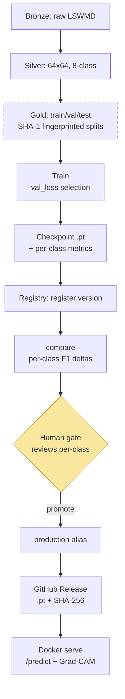

[](https://github.com/pqtrng/wm811k-defect-detection/actions/workflows/ci.yml)

# WM-811K Wafer Defect Detection Pipeline

End-to-end pipeline for classifying wafer map defect patterns from the WM-811K dataset, built with a
data-engineering-first design: reproducible preprocessing, a columnar Parquet data layer, and production-style packaging
rather than a one-off notebook.

## Motivation

Semiconductor fabs generate large volumes of wafer inspection data. Defect-pattern recognition (Center, Donut, Edge-Loc,
Edge-Ring, Loc, Scratch, Random, Near-full) is a key signal for yield analysis and equipment health monitoring. This
project treats the ML model as one component inside a maintainable data pipeline — the same way it would run in a fab
environment.

## Architecture



Data flows through Medallion layers to fixed, fingerprinted splits, so every model is compared on the *same* test set.
Training selects on validation loss; the registry keeps promotion a **manual, per-class human gate** — an aggregate
macro-F1 gain can hide a per-class regression. The promoted checkpoint is published to a GitHub Release and served
single-node via FastAPI.

## Dataset

- **Source:** WM-811K (LSWMD) — 811,457 wafer maps from real-world fabrication, ~172,950 labeled across 9 classes
  (8 defect patterns + `none`). Published by Prof. Roger Jang, MIR Lab, National Taiwan University.
- **Download:** [Kaggle — qingyi/wm811k-wafer-map](https://www.kaggle.com/datasets/qingyi/wm811k-wafer-map) (157 MB zip,
  contains `LSWMD.pkl`)
- Heavily imbalanced (the `none` class is ~85% of labeled data); wafer-map dimensions vary per wafer.

### Getting the data

The dataset is not tracked in Git. After cloning, download and place it manually:

```bash
# 1. Download the zip from the Kaggle link above (requires a free Kaggle account)
# 2. Unzip LSWMD.pkl into the bronze layer
mkdir -p data/bronze
unzip ~/Downloads/archive.zip -d data/bronze/
# Expected: data/bronze/LSWMD.pkl  (~214 MB uncompressed)
```

> Note: `LSWMD.pkl` is a legacy Python 2 / old-pandas pickle. The EDA notebook handles it
> with a module shim + `encoding='latin1'`, then writes a clean `LSWMD_clean.pkl` for fast reloads.

## Pipeline Stages

1. **EDA** (`01_eda.ipynb`) — class distribution, wafer-map dimensions, per-defect visualization.
2. **Preprocessing** (`02_preprocessing.ipynb`) — drop `none` and unlabeled wafers, keep 8 defect classes
   (25,519 samples), resize to 64×64 (nearest-neighbor to preserve discrete die values {0,1,2}), stratified
   70/15/15 train/val/test split, written to Parquet. The lossiness of the nearest-neighbor resize is measured rather
   than assumed: density-normalized defect-die preservation across the resize is mean 0.999 / median 1.000 over all
   25,519 wafers,
   no wafer loses its defect signal entirely, and the worst case retains 0.67
   (`make validate`; `docs/figures/die_preservation.png`).

   The processed data is organized as a **Medallion architecture** (bronze/silver/gold):
   immutable raw pickles in `bronze/`, a single cleaned-and-resized table in `silver/`
   (not yet split), and the stratified train/val/test splits in `gold/`. Splitting is a
   modeling decision (ratios, seed) kept separate from cleaning, which lets `make verify-gold`
   deterministically rebuild the gold splits from silver and compare them row-by-row
   (order-independent SHA-1 fingerprint over wafer bytes + label + lotName + waferIndex)
   against what is on disk — a mismatch fails the gate rather than silently drifting.
3. **Modeling** (`03_train.ipynb`) — baseline CNN → ResNet-18 from scratch → + domain-safe augmentation (no ImageNet
   pretraining: wafer maps are single-channel discrete-valued images, a different domain from natural images).
   Checkpoint selection and early stopping use val_loss rather than val_macro_f1: macro-F1 is noisy
   epoch-to-epoch on this validation set (tiny classes like Near-full, n=22, make it jump in steps).
   Across selection strategies the differences were modest; val_loss is kept for stability of the
   selection criterion rather than for a large measured win. Class imbalance handled at train time via
   WeightedRandomSampler;
   experiments tracked with MLflow (params/metrics/model per run); evaluated with per-class metrics +
   confusion matrix on a natural-distribution test set, not aggregate accuracy.
4. **Pipeline packaging** — the notebook pipeline is refactored into an installable package
   (`src/wm811k/`) with CLI entry points (`python -m wm811k.train`, `python -m wm811k.evaluate`).
   A full CLI retrain reproduces the notebook result within a ±0.01 parity criterion
   (test macro-F1 0.915 vs 0.920; GPU nondeterminism accounts for the gap), and every number
   in the Results table below is reproducible via `wm811k.evaluate` against its checkpoint.

## Results

A 2×2 grid of controlled experiments (architecture × augmentation), tracked in MLflow. Results are on the
test set (3,828 samples); macro-F1 is the primary metric because the classes are imbalanced, with accuracy
as secondary.

| Model                          | Variable isolated            | Macro-F1  | Accuracy | Test loss |
|:-------------------------------|:-----------------------------|:----------|:---------|:----------|
| Baseline CNN (~94K params)     | —                            | 0.828     | 0.859    | 0.382     |
| CNN + augmentation             | regularization (small model) | 0.804     | 0.847    | 0.412     |
| ResNet-18 from scratch (11.2M) | capacity                     | 0.880     | 0.919    | 0.287     |
| ResNet-18 + augmentation       | regularization (large model) | **0.920** | 0.942    | 0.167     |

- CNN→ResNet (capacity): the catch-all Loc class gained most — recall 0.49→0.84, F1 0.598→0.832;
  Loc→Center errors fell 123→28 and Loc→Edge-Loc 104→28; Edge-Ring→Edge-Loc confusion dropped 70→25.
  Already-strong classes (Edge-Ring) stayed near ceiling — capacity, not a data/label ceiling, was the
  bottleneck.
- Augmentation × capacity interaction: the same augmentation *hurt* the small CNN (macro-F1 −0.024,
  test loss 0.382→0.412) but *helped* ResNet (+0.040) — at 94K params the CNN underfits the more varied
  training distribution, while ResNet has the capacity to exploit it. Augmentation is domain-safe by
  construction: only 90° rotations + flips, which permute pixels (discrete {0,1,2} values preserved,
  no interpolation) and are center-preserving (edge-vs-center labels stay valid; crops/translations
  would corrupt them). On ResNet it lifted exactly the low-sample, high-variety classes:
  Scratch +0.081 (0.790→0.871), Donut +0.051, Near-full 0.913→0.978.
- Honest limitation: Loc remains the weakest class (F1 0.857) and still absorbs its neighbors' errors —
  in the final model 44 Loc wafers are predicted Edge-Loc and 18 Scratch, and augmentation improved Loc
  precision but not recall (0.844→0.837). A likely genuine morphological ambiguity that geometric
  augmentation alone can't resolve. The data path is exonerated as a cause: measured die preservation across the 64×64
  resize is
  near-perfect (median 1.000, zero total losses), so the ambiguity lives in the defect morphology
  itself — though it is telling that the worst-preserved wafers are predominantly Loc and Scratch.


Grad-CAM on the final model — where the network looks for each class, and what it looked at
when confusing Loc with its neighbors (regenerate with `make gradcam`):


## Scope

This model performs **classification, not detection**. It assumes the input wafer is already known to be defective
and answers "which of the 8 defect types?" — it has no `none` class and will force a defect label onto a good wafer.
This is a deliberate two-stage design decision (see `docs/IDEAS.md`), not a gap: in a full fab pipeline a detection
stage (defective vs. not) would precede this classifier.

## Stack

Python 3.12, uv, PyTorch (CUDA), MLflow (experiment tracking + model registry), pandas, scikit-learn, PyArrow/Parquet,
matplotlib,
seaborn, FastAPI + Docker (serving).

## Why batch — a deliberate architecture decision

Wafer inspection is inherently lot-based: maps arrive in batches per lot, and defect
classification has no millisecond-latency requirement. This pipeline is therefore
batch-first by design — reproducible ingest → validate → preprocess → train → evaluate,
with the cleaned dataset materialized as a columnar Parquet layer — mirroring how
inspection ML integrates into a fab's data backbone as one stage of a scheduled
pipeline rather than an isolated experiment. Choosing batch here is an engineering
decision, not a limitation.

## Setup

```bash
# Install uv: https://docs.astral.sh/uv/
uv venv --python 3.12
uv sync                       # installs from pyproject.toml + uv.lock
uv run jupyter lab            # launch notebooks
```

GPU check:

```bash
uv run python -c "import torch; print(torch.cuda.is_available())"   # expect True
```

## Training & evaluation (CLI)

```bash
# Train (checkpoint lands in models/, run logged to MLflow)
uv run python -m wm811k.train --model resnet18 --augment
uv run python -m wm811k.train --model resnet18 --augment --epochs 2   # cheap smoke test
uv run python -m wm811k.train --model resnet18 --augment --register   # train + register a version

# Evaluate a checkpoint: per-class report + confusion matrix
uv run python -m wm811k.evaluate --checkpoint models/resnet18-aug_best.pt \
    --model resnet18 --split test --title "resnet18-aug (test)"

# Or via Makefile
make train ARGS='--augment'
make evaluate CHECKPOINT=models/resnet18-aug_best.pt
```

## Model Registry

Trained models are versioned in an MLflow Model Registry entry named `wm811k-defect-classifier`.
Registration and promotion are **two separate steps on purpose**:

```bash
# 1. Train and register a new version (does NOT promote)
uv run python -m wm811k.train --model resnet18 --augment --register

# 2. Review per-class F1 deltas against the current production model
uv run python -m wm811k.registry compare --candidate <version>

# 3. Promote — the manual gate — only after reviewing the deltas
uv run python -m wm811k.registry promote --version <version>
```

`register` creates a version but never aliases it to `@production`. Promotion is a deliberate
manual command because an aggregate macro-F1 gain can mask a per-class regression — `compare`
surfaces exactly that (per-class F1 delta, with regressions flagged) so a human decides before
a model goes live. Serving loads whatever version currently holds the `@production` alias.
The rationale, and why automatic promotion is rejected, is recorded in `docs/IDEAS.md` (#6/#7).

## Serving

Single-node FastAPI + Docker serving layer for the production classifier (inference + optional Grad-CAM).

### Docker quickstart

```bash
docker compose up -d
curl -s localhost:8000/health | jq
docker compose down
```

`/health` returns:

```json
{
  "status": "ok",
  "model_loaded": true,
  "device": "cpu",
  "num_classes": 8
}
```

### API

- `GET /health` — liveness + what actually loaded.
- `POST /predict` — classify one wafer map.
- `POST /predict?gradcam=true` — classify + return a 64×64 Grad-CAM heatmap (values in [0,1]).

Input contract (same for both predict paths):

- Send RAW wafer maps (do not normalize); die values must be in `{0,1,2}`.
- Shape can be either a flat 4096-length list or a nested 64×64 list.
- Bad shape/value returns HTTP 422.

Example: `/predict` (flat 4096):

```bash
python - <<'PY' | curl -s -X POST localhost:8000/predict -H 'Content-Type: application/json' -d @- | jq
import json
# 4096 RAW die values in {0,1,2}; do not normalize before sending.
wafer = [0] * 4096
wafer[123] = 2
print(json.dumps({"wafer": wafer}))
PY
```

Response shape:

- `predicted_class` (label string)
- `class_index` (0–7)
- `probabilities` (full 8-class dict)

Example: `/predict?gradcam=true` (nested 64×64):

```bash
python - <<'PY' | curl -s -X POST 'localhost:8000/predict?gradcam=true' -H 'Content-Type: application/json' -d @- | jq
import json
wafer = [[0] * 64 for _ in range(64)]
wafer[10][20] = 2
print(json.dumps({"wafer": wafer}))
PY
```

Response includes the fields above plus `gradcam` (64×64 array in [0,1]). If `gradcam=true` is requested on a model
without a `layer4` (e.g. the plain CNN), the API returns HTTP 501.

### Local run (no Docker)

```bash
make serve
```

Design notes: serving loads one shared `.pt` checkpoint once at startup and uses it for both `/predict` and
`?gradcam=true` (no `torch.export` GraphModule: Grad-CAM must hook a real `layer4`). Request validation reuses
`check_wafer_grid` (“one rule set, two doors”) so the API enforces the same shape/value contract as the Parquet gates.
The Docker image pulls the canonical checkpoint from the GitHub Release and verifies its SHA-256 at build time; the
MLflow registry stays host-side as the decision layer. Single-node by design: no Kubernetes and no volume mounts.

## Structure

```text
├── configs/ # default.yaml — single source of truth for hyperparameters/paths
├── data/ # dataset (git-ignored), Medallion layers
│ ├── bronze/ # immutable raw: LSWMD.pkl, LSWMD_clean.pkl
│ ├── silver/ # wafers.parquet: 8-class, resized 64×64, NOT split
│ └── gold/ # train/val/test parquet — what the models consume
├── notebooks/ # 01_eda.ipynb, 02_preprocessing.ipynb, 03_train.ipynb
├── src/wm811k/ # installable pipeline package
│ ├── config.py # YAML-driven Config (frozen dataclasses)
│ ├── data.py # WaferDataset, domain-safe augmentation, loaders
│ ├── pipeline.py # Medallion bronze→silver→gold + verify-gold gate
│ ├── validation.py # Pandera schema gates (silver + gold) + check_wafer_grid
│ ├── quality.py # die-preservation metric, resize/flatten_label
│ ├── validate.py # CLI data quality gate
│ ├── models.py # WaferCNN, WaferResNet18, build_model factory
│ ├── engine.py # train/evaluate loops, MLflow logging, checkpointing
│ ├── registry.py # MLflow registry: register / promote / compare / load_production
│ ├── serve.py # FastAPI serving: /predict, /health, Grad-CAM (loads .pt)
│ ├── train.py # CLI: python -m wm811k.train
│ ├── evaluate.py # CLI: python -m wm811k.evaluate
│ └── seed.py # reproducibility
├── tests/ # pytest suite: contract tests (shapes, gates, API), no real data
├── docs/ # IDEAS.md (deferred extensions, scope rationale)
├── models/ # trained checkpoints (git-ignored)
├── Dockerfile # serving image: model pulled from Release + SHA-verified
├── docker-compose.yml # single-service serve on :8000
├── .dockerignore
├── Makefile # install / silver / gold / verify-gold / validate / train / evaluate / serve / test / lint
├── pyproject.toml
└── uv.lock
```
