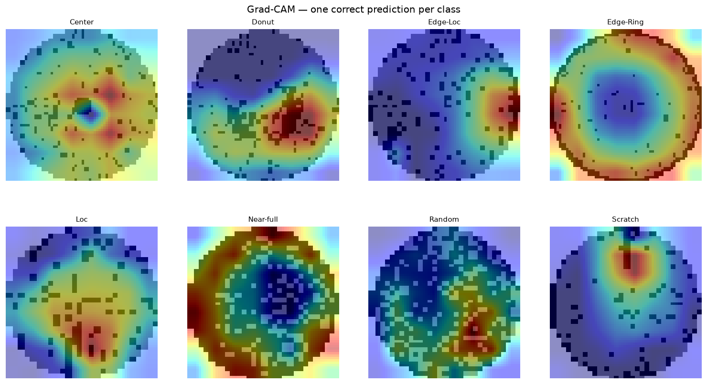
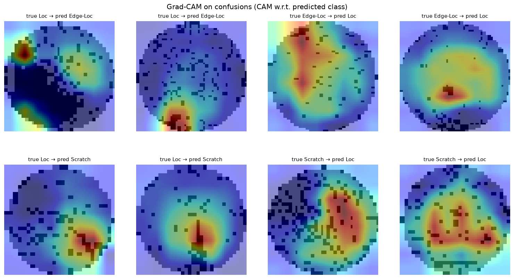

# WM-811K Wafer Defect Detection Pipeline

End-to-end pipeline for classifying wafer map defect patterns from the WM-811K dataset, built with a
data-engineering-first design: reproducible preprocessing, a columnar Parquet data layer, and production-style packaging
rather than a one-off notebook.

## Motivation

Semiconductor fabs generate large volumes of wafer inspection data. Defect-pattern recognition (Center, Donut, Edge-Loc,
Edge-Ring, Loc, Scratch, Random, Near-full) is a key signal for yield analysis and equipment health monitoring. This
project treats the ML model as one component inside a maintainable data pipeline — the same way it would run in a fab
environment.

## Dataset

- **Source:** WM-811K (LSWMD) — 811,457 wafer maps from real-world fabrication, ~172,950 labeled across 9 classes
  (8 defect patterns + `none`). Published by Prof. Roger Jang, MIR Lab, National Taiwan University.
- **Download:** [Kaggle — qingyi/wm811k-wafer-map](https://www.kaggle.com/datasets/qingyi/wm811k-wafer-map) (157 MB zip,
  contains `LSWMD.pkl`)
- Heavily imbalanced (the `none` class is ~85% of labeled data); wafer-map dimensions vary per wafer.

### Getting the data

The dataset is not tracked in Git. After cloning, download and place it manually:

```bash
# 1. Download the zip from the Kaggle link above (requires a free Kaggle account)
# 2. Unzip LSWMD.pkl into data/
unzip ~/Downloads/archive.zip -d data/
# Expected: data/LSWMD.pkl  (~214 MB uncompressed)
```

> Note: `LSWMD.pkl` is a legacy Python 2 / old-pandas pickle. The EDA notebook handles it
> with a module shim + `encoding='latin1'`, then writes a clean `LSWMD_clean.pkl` for fast reloads.

## Pipeline Stages

1. **EDA** (`01_eda.ipynb`) — class distribution, wafer-map dimensions, per-defect visualization.
2. **Preprocessing** (`02_preprocessing.ipynb`) — drop `none` and unlabeled wafers, keep 8 defect classes
   (25,519 samples), resize to 64×64 (nearest-neighbor to preserve discrete die values {0,1,2}), stratified
   70/15/15 train/val/test split, written to Parquet.
3. **Modeling** (`03_train.ipynb`) — baseline CNN → ResNet-18 from scratch → + domain-safe augmentation (no ImageNet
   pretraining: wafer maps are single-channel discrete-valued images, a different domain from natural images).
   Checkpoint selection and early stopping use val_loss rather than val_macro_f1: macro-F1 is noisy
   epoch-to-epoch on this validation set (tiny classes like Near-full, n=22, make it jump in steps), and
   across three selection strategies val_loss-for-both tested best — 0.835 vs 0.831 (F1 for both) and
   0.827 (F1 checkpointing, val_loss stopping) — though the gap is modest; val_loss is kept for stability
   rather than for a large measured win. Class imbalance handled at train time via WeightedRandomSampler;
   experiments tracked with MLflow (params/metrics/model per run); evaluated with per-class metrics +
   confusion matrix on a natural-distribution test set, not aggregate accuracy.
4. **Pipeline packaging** — the notebook pipeline is refactored into an installable package
   (`src/wm811k/`) with CLI entry points (`python -m wm811k.train`, `python -m wm811k.evaluate`).
   A full CLI retrain reproduces the notebook result within a ±0.01 parity criterion
   (test macro-F1 0.915 vs 0.920; GPU nondeterminism accounts for the gap), and every number
   in the Results table below is reproducible via `wm811k.evaluate` against its checkpoint.

## Results

A 2×2 grid of controlled experiments (architecture × augmentation), tracked in MLflow. Results are on the
test set (3,828 samples); macro-F1 is the primary metric because the classes are imbalanced, with accuracy
as secondary.

| Model                          | Variable isolated            | Macro-F1  | Accuracy | Test loss |
|:-------------------------------|:-----------------------------|:----------|:---------|:----------|
| Baseline CNN (~94K params)     | —                            | 0.828     | 0.859    | 0.382     |
| CNN + augmentation             | regularization (small model) | 0.804     | 0.847    | 0.412     |
| ResNet-18 from scratch (11.2M) | capacity                     | 0.880     | 0.919    | 0.287     |
| ResNet-18 + augmentation       | regularization (large model) | **0.920** | 0.942    | 0.167     |

- CNN→ResNet (capacity): the catch-all Loc class gained most — recall 0.49→0.84, F1 0.598→0.832;
  Loc→Center errors fell 123→28 and Loc→Edge-Loc 104→28; Edge-Ring→Edge-Loc confusion dropped 70→25.
  Already-strong classes (Edge-Ring) stayed near ceiling — capacity, not a data/label ceiling, was the
  bottleneck.
- Augmentation × capacity interaction: the same augmentation *hurt* the small CNN (macro-F1 −0.024,
  test loss 0.382→0.412) but *helped* ResNet (+0.040) — at 94K params the CNN underfits the more varied
  training distribution, while ResNet has the capacity to exploit it. Augmentation is domain-safe by
  construction: only 90° rotations + flips, which permute pixels (discrete {0,1,2} values preserved,
  no interpolation) and are center-preserving (edge-vs-center labels stay valid; crops/translations
  would corrupt them). On ResNet it lifted exactly the low-sample, high-variety classes:
  Scratch +0.081 (0.790→0.871), Donut +0.051, Near-full 0.913→0.978.
- Honest limitation: Loc remains the weakest class (F1 0.857) and still absorbs its neighbors' errors —
  in the final model 44 Loc wafers are predicted Edge-Loc and 18 Scratch, and augmentation improved Loc
  precision but not recall (0.844→0.837). A likely genuine morphological ambiguity that geometric
  augmentation alone can't resolve.


Grad-CAM on the final model — where the network looks for each class, and what it looked at
when confusing Loc with its neighbors (regenerate with `make gradcam`):




## Scope

This model performs **classification, not detection**. It assumes the input wafer is already known to be defective
and answers "which of the 8 defect types?" — it has no `none` class and will force a defect label onto a good wafer.
This is a deliberate two-stage design decision (see `docs/IDEAS.md`), not a gap: in a full fab pipeline a detection
stage (defective vs. not) would precede this classifier.

## Stack

Python 3.12, uv, PyTorch (CUDA), MLflow (experiment tracking), pandas, scikit-learn, PyArrow/Parquet, matplotlib,
seaborn.

## Why batch — a deliberate architecture decision

Wafer inspection is inherently lot-based: maps arrive in batches per lot, and defect
classification has no millisecond-latency requirement. This pipeline is therefore
batch-first by design — reproducible ingest → validate → preprocess → train → evaluate,
with the cleaned dataset materialized as a columnar Parquet layer — mirroring how
inspection ML integrates into a fab's data backbone as one stage of a scheduled
pipeline rather than an isolated experiment. Choosing batch here is an engineering
decision, not a limitation.

## Setup

```bash
# Install uv: https://docs.astral.sh/uv/
uv venv --python 3.12
uv sync                       # installs from pyproject.toml + uv.lock
uv run jupyter lab            # launch notebooks
```

GPU check:

```bash
uv run python -c "import torch; print(torch.cuda.is_available())"   # expect True
```

## Training & evaluation (CLI)

```bash
# Train (checkpoint lands in models/, run logged to MLflow)
uv run python -m wm811k.train --model resnet18 --augment
uv run python -m wm811k.train --model resnet18 --augment --epochs 2   # cheap smoke test

# Evaluate a checkpoint: per-class report + confusion matrix
uv run python -m wm811k.evaluate --checkpoint models/resnet18-aug_best.pt \
    --model resnet18 --split test --title "resnet18-aug (test)"

# Or via Makefile
make train ARGS='--augment'
make evaluate CHECKPOINT=models/resnet18-aug_best.pt
```

## Structure

```
├── configs/      # default.yaml — single source of truth for hyperparameters/paths
├── data/         # dataset (git-ignored)
│   ├── LSWMD.pkl, LSWMD_clean.pkl
│   └── processed/    # train/val/test parquet outputs
├── notebooks/    # 01_eda.ipynb, 02_preprocessing.ipynb, 03_train.ipynb
├── src/wm811k/   # installable pipeline package
│   ├── config.py     # YAML-driven Config (frozen dataclasses)
│   ├── data.py       # WaferDataset, domain-safe augmentation, loaders
│   ├── models.py     # WaferCNN, WaferResNet18, build_model factory
│   ├── engine.py     # train/evaluate loops, MLflow logging, checkpointing
│   ├── train.py      # CLI: python -m wm811k.train
│   ├── evaluate.py   # CLI: python -m wm811k.evaluate
│   └── seed.py       # reproducibility
├── docs/         # IDEAS.md (deferred extensions, scope rationale)
├── models/       # trained checkpoints (git-ignored)
├── Makefile      # install / notebook / mlflow-server / train / evaluate
├── pyproject.toml
└── uv.lock
```