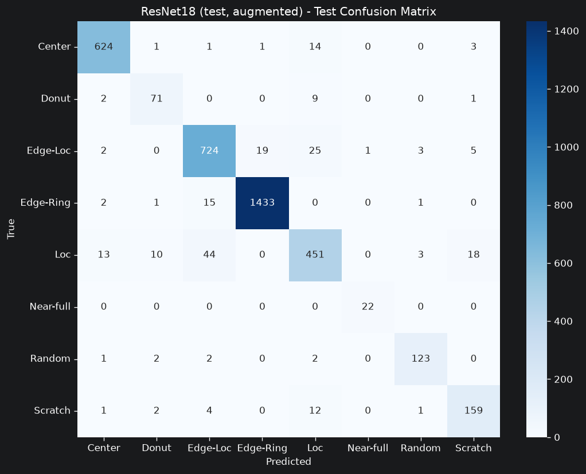

# WM-811K Wafer Defect Detection Pipeline

End-to-end pipeline for classifying wafer map defect patterns from the WM-811K dataset, built with a
data-engineering-first design: reproducible preprocessing, a columnar Parquet data layer, and production-style packaging
rather than a one-off notebook.

## Motivation

Semiconductor fabs generate large volumes of wafer inspection data. Defect-pattern recognition (Center, Donut, Edge-Loc,
Edge-Ring, Loc, Scratch, Random, Near-full) is a key signal for yield analysis and equipment health monitoring. This
project treats the ML model as one component inside a maintainable data pipeline — the same way it would run in a fab
environment.

## Dataset

- **Source:** WM-811K (LSWMD) — 811,457 wafer maps from real-world fabrication, ~172,950 labeled across 9 classes
  (8 defect patterns + `none`). Published by Prof. Roger Jang, MIR Lab, National Taiwan University.
- **Download:** [Kaggle — qingyi/wm811k-wafer-map](https://www.kaggle.com/datasets/qingyi/wm811k-wafer-map) (157 MB zip,
  contains `LSWMD.pkl`)
- Heavily imbalanced (the `none` class is ~85% of labeled data); wafer-map dimensions vary per wafer.

### Getting the data

The dataset is not tracked in Git. After cloning, download and place it manually:

```bash
# 1. Download the zip from the Kaggle link above (requires a free Kaggle account)
# 2. Unzip LSWMD.pkl into data/
unzip ~/Downloads/archive.zip -d data/
# Expected: data/LSWMD.pkl  (~214 MB uncompressed)
```

> Note: `LSWMD.pkl` is a legacy Python 2 / old-pandas pickle. The EDA notebook handles it
> with a module shim + `encoding='latin1'`, then writes a clean `LSWMD_clean.pkl` for fast reloads.

## Pipeline Stages

1. **EDA** (`01_eda.ipynb`) — class distribution, wafer-map dimensions, per-defect visualization.
2. **Preprocessing** (`02_preprocessing.ipynb`) — drop `none` and unlabeled wafers, keep 8 defect classes
   (25,519 samples), resize to 64×64 (nearest-neighbor to preserve discrete die values {0,1,2}), stratified
   70/15/15 train/val/test split, written to Parquet.
3. **Modeling** (`03_train.ipynb`) — baseline CNN → ResNet-18 from scratch → + domain-safe augmentation (no ImageNet
   pretraining: wafer maps are single-channel discrete-valued images, a different domain from natural images).
   Checkpoint selection uses val_loss rather than val_macro_f1, because macro-F1 is too noisy epoch-to-epoch on
   this validation set to be a reliable selection/stopping criterion (verified: val_loss selection gave 0.831 vs
   0.751 for F1-based on the CNN). Class imbalance handled at train time via WeightedRandomSampler; experiments
   tracked with MLflow (params/metrics/model per run); evaluated with per-class metrics + confusion matrix on a
   natural-distribution test set, not aggregate accuracy.
4. **Pipeline packaging (in progress)** — training + inference are being refactored
   from the notebooks into re-runnable modules under `src/wm811k/`.

## Results

Three controlled experiments, each isolating one variable, tracked in MLflow. Results are on the test set
(3,828 samples); macro-F1 is the primary metric because the classes are imbalanced, with accuracy as secondary.

| Model                          | Variable isolated | Macro-F1 | Accuracy | Test loss |
|:-------------------------------|:------------------|:---------|:---------|:----------|
| Baseline CNN (~94K params)     | —                 | 0.831    | 0.867    | 0.356     |
| ResNet-18 from scratch (11.2M) | capacity          | 0.895    | 0.921    | 0.262     |
| ResNet-18 + augmentation       | regularization    | 0.923    | 0.943    | 0.167     |

- CNN→ResNet: capacity was the bottleneck for ambiguous classes. Center→Loc misclassifications dropped 109→15.
  Weakest classes gained most (Loc, Scratch, Center); already-strong classes (Edge-Ring, Near-full) stayed
  near ceiling — confirming the capacity hypothesis rather than a data/label ceiling.
- ResNet→augmentation: reduced overfitting — train/val loss gap narrowed ~0.22→0.09. Augmentation is
  domain-safe by construction: only 90° rotations + flips, which permute pixels (discrete {0,1,2} values
  preserved, no interpolation) and are center-preserving (edge-vs-center labels stay valid; crops/translations
  would corrupt them). Loc +0.053, Donut +0.057, Near-full reached F1 1.000.
- Honest limitation: Scratch barely moved (+0.003), still confused with Loc — a likely genuine
  morphological ambiguity that geometric augmentation can't resolve.



## Scope

This model performs **classification, not detection**. It assumes the input wafer is already known to be defective
and answers "which of the 8 defect types?" — it has no `none` class and will force a defect label onto a good wafer.
This is a deliberate two-stage design decision (see `docs/IDEAS.md`), not a gap: in a full fab pipeline a detection
stage (defective vs. not) would precede this classifier.

## Stack

Python 3.12, uv, PyTorch (CUDA), MLflow (experiment tracking), pandas, scikit-learn, PyArrow/Parquet, matplotlib,
seaborn.

## Why batch — a deliberate architecture decision

Wafer inspection is inherently lot-based: maps arrive in batches per lot, and defect
classification has no millisecond-latency requirement. This pipeline is therefore
batch-first by design — reproducible ingest → validate → preprocess → train → evaluate,
with the cleaned dataset materialized as a columnar Parquet layer — mirroring how
inspection ML integrates into a fab's data backbone as one stage of a scheduled
pipeline rather than an isolated experiment. Choosing batch here is an engineering
decision, not a limitation.

## Setup

```bash
# Install uv: https://docs.astral.sh/uv/
uv venv --python 3.12
uv sync                       # installs from pyproject.toml + uv.lock
uv run jupyter lab            # launch notebooks
```

GPU check:

```bash
uv run python -c "import torch; print(torch.cuda.is_available())"   # expect True
```

## Structure

```
├── data/         # dataset (git-ignored)
│   ├── LSWMD.pkl, LSWMD_clean.pkl
│   └── processed/    # train/val/test parquet outputs
├── notebooks/    # 01_eda.ipynb, 02_preprocessing.ipynb, 03_train.ipynb
├── src/          # pipeline package (refactor in progress)
├── docs/         # IDEAS.md (deferred extensions, scope rationale)
├── models/       # trained checkpoints (git-ignored)
├── pyproject.toml
└── uv.lock
```
