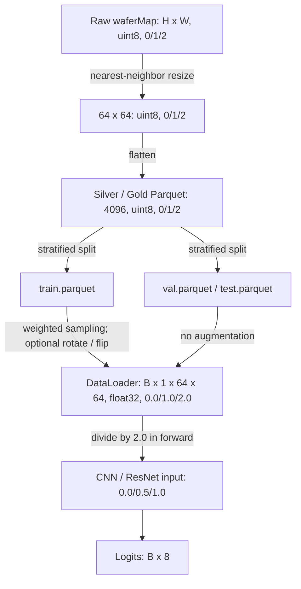

# WM-811K Data Flow

```text
Raw waferMap                         H x W, uint8, values {0, 1, 2}
  |
  | nearest-neighbor resize
  v
64 x 64 wafer map                    uint8, values {0, 1, 2}
  |
  | flatten
  v
Silver / Gold Parquet                (4096,), uint8, values {0, 1, 2}
  |
  | stratified 70 / 15 / 15 split
  +--------------------------+---------------------------+
  v                          v                           v
train.parquet                val.parquet                 test.parquet
  |                          |                           |
  | weighted sampling        | no augmentation           | no augmentation
  | optional rotate / flip   |                           |
  +--------------------------+---------------------------+
                             |
                             | stack + reshape + float32
                             v
DataLoader batch                     (B, 1, 64, 64), float32, {0.0, 1.0, 2.0}
  |
  | divide by 2.0 inside model.forward()
  v
CNN / ResNet input                   (B, 1, 64, 64), float32, {0.0, 0.5, 1.0}
  |
  v
Logits                                (B, 8), arbitrary float values
```



`test_validation.py` validates the Parquet contract: each wafer must have shape `(4096,)` and values in `{0, 1, 2}`. It does not transform the train or test dataset.
