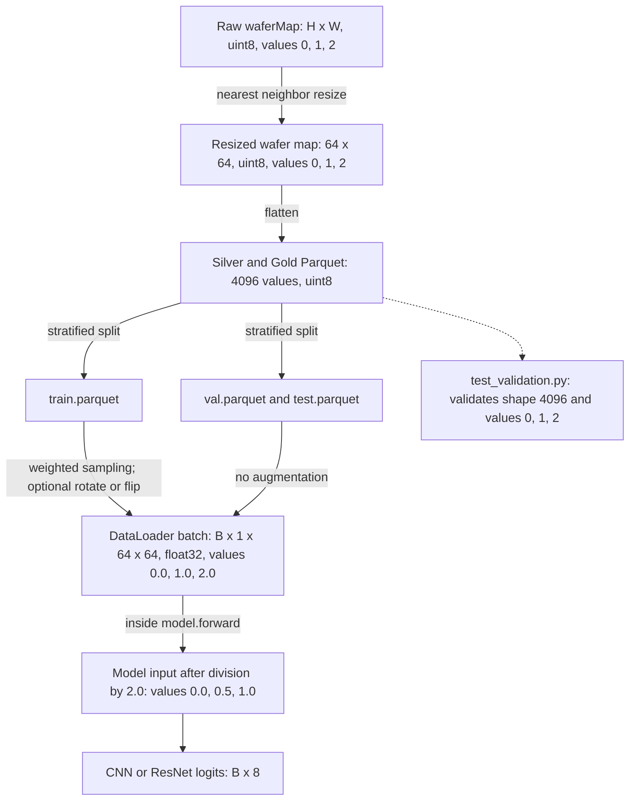

# WM-811K Data Flow

```mermaid
flowchart TD
    RAW["Raw waferMap: H x W, uint8, values 0, 1, 2"]
    RESIZED["Resized wafer map: 64 x 64, uint8, values 0, 1, 2"]
    PARQUET["Silver and Gold Parquet: 4096 values, uint8"]
    TRAIN["train.parquet"]
    EVAL["val.parquet and test.parquet"]
    LOADER["DataLoader batch: B x 1 x 64 x 64, float32, values 0.0, 1.0, 2.0"]
    MODEL["Model input after division by 2.0: values 0.0, 0.5, 1.0"]
    LOGITS["CNN or ResNet logits: B x 8"]
    VALIDATION["test_validation.py: validates shape 4096 and values 0, 1, 2"]

    RAW -->|"nearest neighbor resize"| RESIZED
    RESIZED -->|"flatten"| PARQUET
    PARQUET -->|"stratified split"| TRAIN
    PARQUET -->|"stratified split"| EVAL
    TRAIN -->|"weighted sampling; optional rotate or flip"| LOADER
    EVAL -->|"no augmentation"| LOADER
    LOADER -->|"inside model.forward"| MODEL
    MODEL --> LOGITS
    PARQUET -.-> VALIDATION
```
