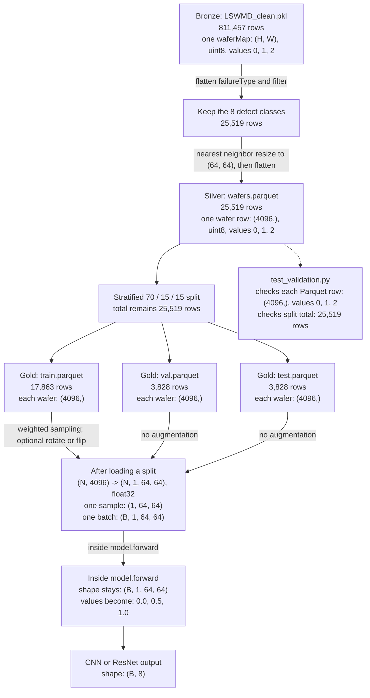

# WM-811K Data Flow

Shape notation: `N` = number of wafers loaded from a split; `B` = wafers in one DataLoader batch.

```mermaid
flowchart TD
    RAW["Bronze: LSWMD_clean.pkl<br/>811,457 rows<br/>one waferMap: (H, W), uint8, values 0, 1, 2"]
    FILTERED["Keep the 8 defect classes<br/>25,519 rows"]
    PARQUET["Silver: wafers.parquet<br/>25,519 rows<br/>one wafer row: (4096,), uint8, values 0, 1, 2"]
    SPLIT["Stratified 70 / 15 / 15 split<br/>total remains 25,519 rows"]
    TRAIN["Gold: train.parquet<br/>17,863 rows<br/>each wafer: (4096,)"]
    VAL["Gold: val.parquet<br/>3,828 rows<br/>each wafer: (4096,)"]
    TEST["Gold: test.parquet<br/>3,828 rows<br/>each wafer: (4096,)"]
    LOADER["After loading a split<br/>(N, 4096) -> (N, 1, 64, 64), float32<br/>one sample: (1, 64, 64)<br/>one batch: (B, 1, 64, 64)"]
    MODEL["Inside model.forward<br/>shape stays: (B, 1, 64, 64)<br/>values become: 0.0, 0.5, 1.0"]
    LOGITS["CNN or ResNet output<br/>shape: (B, 8)"]
    VALIDATION["test_validation.py<br/>checks each Parquet row: (4096,), values 0, 1, 2<br/>checks split total: 25,519 rows"]

    RAW -->|"flatten failureType and filter"| FILTERED
    FILTERED -->|"nearest neighbor resize to (64, 64), then flatten"| PARQUET
    PARQUET --> SPLIT
    SPLIT --> TRAIN
    SPLIT --> VAL
    SPLIT --> TEST
    TRAIN -->|"weighted sampling; optional rotate or flip"| LOADER
    VAL -->|"no augmentation"| LOADER
    TEST -->|"no augmentation"| LOADER
    LOADER -->|"inside model.forward"| MODEL
    MODEL --> LOGITS
    PARQUET -.-> VALIDATION
```
